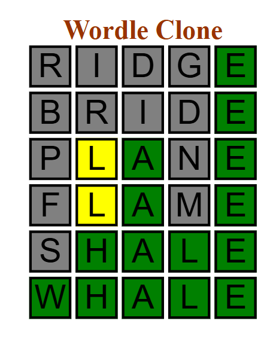

# Wordle Clone

## Overview 🧭

This Wordle clone is a web-based word-guessing game where players try to guess a hidden word within a limited number of attempts, six. Each guess must be a valid word of a fixed length (five letters). After each guess, the game provides feedback by coloring the tiles:

- Green: The letter is correct and in the right position.
- Yellow: The letter is in the word but in the wrong position.
- Gray: The letter is not in the word.

The game provides a new word each time you refresh the page.

  

## Features 🔧

- **Simplistic Frontend Design**: Easy to use and play
- **New Word Every Refresh**: A new word everytime you refresh the page

## Usage 🛠️

Clone the repository and open index.html

## License 📄

This project is licensed under the MIT License - see the [LICENSE](LICENSE) file for details.
